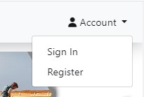

# Advertisement Service Project README

**Developer: Sanor Smith**

💻 [Visit Live Website](https://ads2024-b8f5bf8e98be.herokuapp.com/)

## Table of Contents
- [About](#about)
- [User Goals](#user-goals)
- [Site Owner Goals](#site-owner-goals)
- [User Experience](#user-experience)
- [User Stories](#user-stories)
- [Design](#design)
  - [Colors](#colors)
  - [Fonts](#fonts)
  - [Structure](#structure)
    - [Website Pages](#website-pages)
    - [Database Models](#database-models)
  - [Wireframes](#wireframes)
- [Technologies Used](#technologies-used)
- [Features](#features)
- [Validation](#validation)
- [Testing](#testing)
- [Bugs](#bugs)
- [Configuration](#configuration)
  - [Setting Up Environment](#setting-up-environment)
  - [Forking the GitHub Repository](#forking-the-github-repository)
  - [Making a Local Clone](#making-a-local-clone)
- [Credits](#credits)
- [Acknowledgements](#acknowledgements)

## About

The Advertisement Service is a web-based platform designed for creating, managing, and advertisement professional services . Users can create targeted ads, monitor performance through analytics, and manage subscriptions for enhanced services.

## User Goals
1. Create effective advertisement campaigns.
2. Monitor campaign analytics and performance.
3. Access affordable pricing plans.
4. Easily navigate the platform.
5. Provide feedback to improve services.
6. Access user-friendly support.
7. Customize advertisements for specific audiences.
8. View all active and past advertisements.
9. Receive real-time analytics reports.
10. Find answers to common questions in the FAQ section.

## Site Owner Goals
1. Offer a user-friendly platform for creating advertisements.
2. Provide real-time analytics to help users track campaign performance.
3. Offer tiered pricing plans.
4. Maintain an easy-to-update admin dashboard.
5. Collect user feedback for service improvement.
6. Ensure secure data management.
7. Provide a seamless user onboarding experience.
8. Enable scalable subscription services.
9. Implement automated marketing features.
10. Ensure the platform is accessible on all devices.

## User Experience

### Target Audience
- Small business owners looking for affordable advertising solutions.
- Marketing agencies managing multiple campaigns.
- Individuals promoting personal projects or businesses.
- Large corporations seeking a scalable advertising solution.

### User Requirements and Expectations
- A smooth sign-up and login experience.
- Easy-to-follow advertisement creation process.
- Clear analytics and reporting.
- Quick access to customer support.
- Secure payment options.
- The ability to customize and edit advertisements.
- Responsive design on all devices.
- Fast-loading pages.
- Regular updates and feature additions.
- Access to promotional offers and discounts.

##### Back to [top](#table-of-contents)

## User Stories

## User Stories

### As a Site User

1. As a site user, I want to browse a wide range of service categories (construction, renovation, landscaping, etc.) so that I can find the service that suits my needs.
2. As a site user, I want to be able to filter services by category, location, and expertise to quickly find the right professionals.
3. As a site user, I want to see detailed profiles of service providers, including their qualifications, experience, and sample projects.
4. As a site user, I want to view high-quality images of previous projects to assess the quality of the provider's work.
5. As a site user, I want the ability to contact service providers directly via a contact form or listed phone number for quick inquiries.
6. As a site user, I want to save my favorite service providers to my profile so I can easily access them later.
7. As a site user, I want to edit and update my profile information, including personal details and contact preferences.
8. As a site user, I want to be able to create, edit, and delete reviews for services I've used, helping other users with their decisions.
9. As a site user, I want to upload images related to the service I received, such as before and after pictures, to provide a more comprehensive review.
10. As a site user, I want the website to be mobile-friendly so that I can access it from any device.
11. As a site user, I want the site to load quickly and efficiently without lag, ensuring a smooth browsing experience.
12. As a site user, I want to be able to search for service providers based on my location to find nearby professionals.
13. As a site user, I want a straightforward registration and login process to quickly access my saved providers and reviews.

### As a Site Owner
1. As a site owner, I want to provide an easy-to-use registration process for professionals, ensuring more service listings.
2. As a site owner, I want to ensure that only registered professionals can create listings to maintain quality and reliability.
3. As a site owner, I want to have a user-friendly admin dashboard to manage all user accounts, service listings, and reviews efficiently.
4. As a site owner, I want to be able to edit, approve, or delete service listings to maintain a high standard of service quality on the platform.
5. As a site owner, I want to implement a system for reporting inappropriate or fraudulent service listings, ensuring user safety.
6. As a site owner, I want to have control over the categories and filters available for service listings to ensure relevant and useful results.
7. As a site owner, I want to ensure that the platform is fully responsive and accessible, catering to all device users.
8. As a site owner, I want to be able to view detailed reports on user engagement (number of active listings, registered users, etc.) to improve the platform's functionality.
9. As a site owner, I want to manage featured listings on the homepage to promote high-quality or premium services.
10. As a site owner, I want to have a clear and easy process for service providers to update their listings, ensuring up-to-date information.

## Design

### Colors
- The color scheme is modern and professional, using shades of blue, grey, and white for clarity and focus.

### Fonts

The project uses a combination of fonts for clarity and visual appeal:

1. **Roboto** - A modern sans-serif font used for its readability and versatility across different screen sizes, ideal for body text and interface elements.

2. **Open Sans** - Complements Roboto with its simple, clear design, often used for body text, buttons, and forms.

3. **Lora** - A serif font used for headers and subheadings, adding a classic and elegant touch to contrast the sans-serif fonts.

This mix ensures readability and a professional look across all pages.

### Structure

1. **Home Page (`home.html`)**
   - **Purpose**: Introduction to the platform, highlighting key features and benefits.
   - **Content**: Sections on connecting clients with professionals, showcasing services, search/filter options, and a user-friendly interface.

2. **Register Page (`register.html`)**
   - **Purpose**: Allows users to create an account.
   - **Content**: Registration form with validation for username, email, and password.

3. **Sign In Page (`sign_in.html`)**
   - **Purpose**: Allows existing users to log in.
   - **Content**: Login form with fields for username/email and password.

4. **Profile Page (`profile.html`)**
   - **Purpose**: Displays user information and their services.
   - **Content**: User details, list of services with edit/delete options, and an "Add New Service" button.

5. **Available Services Page (`available_services.html`)**
   - **Purpose**: Shows all available services.
   - **Content**: Search and filter functionality, service listings in a grid format, with pagination.

6. **Add Service Page (`add_service.html`)**
   - **Purpose**: Allows adding new services.
   - **Content**: Form to add service details like title, description, occupation, and image.

7. **Edit Service Page (`edit_service.html`)**
   - **Purpose**: Enables editing existing services.
   - **Content**: Pre-filled form with existing data for updating service details.

8. **Operations Page (`operations.html`)**
   - **Purpose**: Manage user services.
   - **Content**: Lists user services with edit/remove options and "Add New Service" functionality.

9. **Service Removal Confirmation Page (`remove_service.html`)**
   - **Purpose**: Confirms service deletion.
   - **Content**: Displays service title with a confirm delete button.

10. **Delete Account Page (`delete_account.html`)**
    - **Purpose**: Allows account deletion.
    - **Content**: Confirmation message with a delete button.

11. **Error Pages**
    - **400/403/404/500 (`400.html`, `403.html`, `404.html`, `500.html`)**: Display error messages with a link to the homepage.

12. **Base Template (`base.html`)**
    - **Purpose**: Acts as the main structure for all pages.
    - **Content**: Includes navbar, footer, and blocks for individual page content.

13. **Partial Templates**
    - **Edit Service Form (`partials/edit_service_form.html`)**: Reusable form for editing services.
    - **Add Service Form (`partials/add_service_form.html`)**: Reusable form for adding services.

The structure utilizes Django's templating system, with `base.html` as the foundation, allowing consistent styling across all pages.

#### Database

- The backend uses Django with PostgreSQL for data management in the deployed version.
- Two main models represent the structure of the data stored in PostgreSQL, mimicking the database's contents.

The models representing the website's database structure are:

##### User Model
- Part of Django's built-in authentication system.
- Manages user-related information (username, email, password, etc.).

##### UserProfile Model
- Contains additional user details: bio and contact_info.
- Has a one-to-one relationship with the User model.

##### Service Model
- Stores service details with fields: title, description, occupation, contact_info, featured_image, created_at, and updated_at.
- Has a foreign key relationship with User, representing the service author.

##### ServiceCategory Model
- Represents different categories for services.
- Contains a single `name` field that defines the service category.

These models provide the fundamental data structure for user profiles, service listings, and service categorization, ensuring efficient data handling and retrieval within the application.

### Wireframes

## Technologies Used

### Languages & Frameworks

- **HTML** - For the website's structure.
- **CSS** - For styling the website.
- **JavaScript** - For interactive elements.
- **Python 3.10** - Backend programming language.
- **Django 5.1** - Web framework for backend logic and database management.

### Libraries & Tools

- [Bootstrap 4.5](https://getbootstrap.com/) - Used for responsive UI components (e.g., Navbar, Forms, Buttons).
- [Cloudinary](https://cloudinary.com/) - To manage and host static and media files, like images.
- [Font Awesome](https://fontawesome.com/) - Icons used across the site for visual enhancement.
- [Google Fonts](https://fonts.google.com/) - Applied for typography and fonts.
- [jQuery](https://jquery.com) - Simplified JavaScript functionalities and AJAX requests.
- [PostgreSQL](https://www.postgresql.org/) - Database management system for the deployed project.
- [Visual Studio Code (VSCode)](https://code.visualstudio.com/) - Main code editor used for development.
- [Git](https://git-scm.com/) - Version control system for tracking changes and collaboration.
- [GitHub](https://github.com/) - Hosted the project's code repository.

### Development & Testing Tools

- [Chrome DevTools](https://developers.google.com/web/tools/chrome-devtools/) - For debugging and testing the website's responsiveness.
- [Django Extensions](https://django-extensions.readthedocs.io/) - Provided additional tools for the Django development process.
- [Whitenoise](http://whitenoise.evans.io/en/stable/) - Enabled serving static files efficiently in production.
- [Django Crispy Forms](https://django-crispy-forms.readthedocs.io/) - Enhanced form styling using Bootstrap.
- [PEP8 Online](http://pep8online.com/) - For ensuring Python code follows PEP8 conventions.
- [WC3 Validator](https://validator.w3.org/) - Validated HTML code.
- [Jigsaw W3 Validator](https://jigsaw.w3.org/css-validator/) - Checked CSS code validity.
- [JShint](https://jshint.com/) - Validated JavaScript code quality.

### Deployment & Hosting

- [Heroku](https://www.heroku.com/) - Platform used for deploying and hosting the project.
- [Cloudinary](https://cloudinary.com/) - Hosted media assets and static files for the project.

##### Back to [top](#table-of-contents)

## Features

### Logo and Navigation Bar
- The logo and navigation bar are present on all pages for a consistent look.
- The navigation bar contains links to the Home page, Available Services, and an Update Your Service page.
  - Logged-in users can access a dropdown with options to sign out, view their profile, or delete their account.
  - Non-logged-in users have options to register or sign in.
- The navigation bar is fully responsive, switching to a hamburger menu on smaller screens.
- The logo leads users back to the Home page.
- User stories covered: 1, 6

See feature images

### Home Page
- Features a hero section with a welcome message and description of the website's services.
- Direct buttons lead users to find services or advertise their own services.
- Sections outline key features of the platform, such as connecting professionals with clients and showcasing services.
- User stories covered: 1, 3

See feature images

### Footer
- Displays at the bottom of every page with links to social media (GitHub, LinkedIn, Facebook).
- Contains copyright information.
- User stories covered: 16

See feature images

### Sign Up / Register
- New users can create an account using a registration form with fields for username, email, password, and password confirmation.
- Validates form fields and prevents duplicate email or username registration.
- Successful registration automatically logs in the user.
- User stories covered: 2, 9

See feature images

### Login
- Allows returning users to log in using their username or email and password.
- Displays an error message for incorrect login attempts.
- Successful login redirects users to the "Available Services" page.
- User stories covered: 5, 12

See feature images

### Logout
- Provides a simple process for logging out.
- User stories covered: 7

### Available Services Page
- Lists all services posted on the platform with search and filter functionality.
- Users can filter by occupation or search for specific services using keywords.
- Includes pagination to navigate through multiple pages of services.
- User stories covered: 10, 11

See feature images

### Add Service
- Allows logged-in users to add a new service using a form with fields for title, description, occupation, contact info, and an image.
- User stories covered: 3, 14

See feature images

### Edit Service
- Enables users to update the details of their listed services using an edit form pre-filled with existing information.
- User stories covered: 15

See feature images

### Delete Service
- Allows users to remove a service from the platform with a confirmation prompt.
- User stories covered: 13

See feature images

### Operations Page
- Acts as a dashboard for users to manage their services, allowing them to add, edit, or delete services.
- User stories covered: 17

See feature images

### Delete Account
- Users can delete their account along with all associated services.
- Provides a confirmation prompt to ensure users are aware of the irreversible action.
- User stories covered: 18

See feature images

### Error Pages (400, 403, 404, 500)
- Displays friendly error messages with options to navigate back to the homepage.
- User stories covered: 15

See feature images

### Feedback Messages
- Provides feedback messages throughout the platform for actions such as successful registration, service addition, or deletion.
- User stories covered: 19

See feature images

##### Back to [top](#features)

## Validation
- **HTML**: W3C Validator - No errors found.
- **CSS**: W3C Jigsaw Validator - Passed validation.
- **JavaScript**: JSHint - No significant issues.
- **Python**: PEP8 - Code complies with standards.

## Testing

### Testing Stories

#### 1. **User Authentication Testing**
   - **Test Cases**:
     - *Registration*:
       - Verify that a new user can successfully register with valid details.
       - Test registration with invalid data (e.g., existing email/username, mismatched passwords) to ensure appropriate error messages.
     - *Login*:
       - Ensure that registered users can log in using valid credentials.
       - Test login with invalid credentials (wrong username/password) to confirm error handling.
     - *Logout*:
       - Confirm that logged-in users can successfully log out and are redirected to the home page.

#### 2. **Service Management Testing**
   - **Test Cases**:
     - *Add Service*:
       - Verify that a logged-in user can add a service with valid details.
       - Test adding a service with missing or invalid data (e.g., empty fields) and ensure errors are displayed.
     - *Edit Service*:
       - Ensure users can edit their existing services.
       - Confirm that only valid data is accepted when updating a service.
     - *Delete Service*:
       - Check that a user can delete their service and that it is removed from the list.
       - Ensure a confirmation prompt appears before deletion.

#### 3. **Profile Management Testing**
   - **Test Cases**:
     - Verify that users can view their profile with all associated services listed.
     - Test updating profile information (if applicable) and ensure changes are saved correctly.
     - Ensure that only the user can access and modify their profile.

#### 4. **Search and Filter Testing**
   - **Test Cases**:
     - Ensure that the search functionality works correctly by searching for services using different keywords.
     - Verify that the filter by occupation displays relevant results.
     - Test combinations of search and filter criteria to confirm accurate service listings.

#### 5. **Pagination Testing**
   - **Test Cases**:
     - Verify that the available services page displays pagination when there are more services than the defined limit per page.
     - Test navigating between pages to ensure correct data is displayed.
     - Check that the first and last pages can be accessed without errors.

#### 6. **Error Handling Testing**
   - **Test Cases**:
     - Simulate scenarios to trigger error pages (e.g., unauthorized access, non-existent pages) and ensure the correct error message is displayed:
       - *404 Page*: Check that a user trying to access a non-existent URL is shown a "Page Not Found" message.
       - *403 Page*: Ensure that unauthorized access attempts display a "Forbidden" message.
       - *400 Page*: Validate that invalid requests result in a "Bad Request" message.
       - *500 Page*: Simulate server errors and check for the "Internal Server Error" message.

#### 7. **Session Management Testing**
   - **Test Cases**:
     - Verify that user sessions expire after inactivity and users are required to log in again.
     - Test the "Remember Me" functionality (if implemented) to ensure users stay logged in.

#### 8. **User Interface and Responsiveness Testing**
   - **Test Cases**:
     - Check the responsiveness of the website on different screen sizes (mobile, tablet, desktop).
     - Test the layout and alignment of elements to ensure they display correctly across devices.
     - Verify that all buttons, links, and form fields are clickable and function as expected.

#### 9. **Security Testing**
   - **Test Cases**:
     - Verify that only authenticated users can access restricted pages (e.g., adding/editing/deleting services, profile page).
     - Test for vulnerabilities such as SQL injection, XSS, and CSRF attacks to ensure data is protected.
     - Ensure password fields are encrypted and not visible in plain text.

#### 10. **Database Testing**
   - **Test Cases**:
     - Verify that user registration, service addition, and profile updates correctly save data to the database.
     - Test database constraints (e.g., unique email/username) to prevent duplicate entries.
     - Check that deleting a user or service removes associated records correctly.

#### 11. **Integration Testing**
   - **Test Cases**:
     - Verify that integrated third-party services (e.g., Cloudinary for image uploads) function correctly.
     - Check that images upload and display correctly on the service listing and profile pages.

#### 12. **Cloudinary Integration Testing**
   - **Test Cases**:
     - Confirm that images and other media files are successfully uploaded to Cloudinary.
     - Verify that uploaded images display correctly across the website.
     - Ensure that deleting a service removes the associated image from Cloudinary.

#### 13. **Accessibility Testing**
   - **Test Cases**:
     - Ensure all elements (buttons, links, forms) are accessible via keyboard navigation.
     - Test the website with screen readers to verify that all elements have appropriate labels and descriptions.
     - Confirm that the color contrast and font sizes are suitable for users with visual impairments.

#### 14. **Page Load Performance Testing**
   - **Test Cases**:
     - Verify that the page load time is reasonable, even with multiple images and services listed.
     - Test the site’s performance with tools like Lighthouse or Google PageSpeed Insights.
     - Ensure that images are optimized and served efficiently.

#### 15. **Cross-Browser Compatibility Testing**
   - **Test Cases**:
     - Test the website on multiple browsers (e.g., Chrome, Firefox, Safari, Edge) to ensure consistent appearance and functionality.
     - Verify that JavaScript functions and CSS styles work as expected across different browsers.

### Browser Compatibility
- Google Chrome
- Mozilla Firefox
- Microsoft Edge
- Safari

### Device Testing
- Desktop (Windows, macOS)
- Tablets (iPad, Android tablets)
- Mobile devices (iPhone, Android)

# Bugs

| **Bug**                                              | **Fix**                                                         |
|-----------------------------------------------------|-----------------------------------------------------------------|
| User Authentication Bugs - username/email confusion | Ensure consistent checks for both fields in the login form.     |
| Service Image Upload Issues                         | Validate Cloudinary credentials and file size limits in forms.  |
| Service Category Filtering                          | Pre-populate categories or offer an option to add new ones.     |
| Pagination Bugs                                     | Validate `page_number` input and display a fallback message.    |
| Error Handling Bugs                                 | Verify error handlers in `urls.py` for 400, 403, 404, and 500.  |
| User Session Expiry Handling                        | Implement clear feedback for expired sessions on login page.    |
| Profile Information Update Bugs                     | Include all necessary fields in the `UserProfile` form.         |
| Service Deletion Bugs                               | Verify user permissions before service deletion.               |
| Responsive Design Issues                            | Test media queries in `styles.css` for consistent display.      |
| Cloudinary File Sync Issues                         | Use `invalidate=True` to clear the cache when updating files.   |
| Duplicate User Registration                         | Ensure unique constraints and proper validation in forms.       |
| Form Validation Errors                              | Improve form error handling and display error messages clearly. |
| Missing Service Category Images                     | Use a placeholder image for services missing an uploaded image. |
| Service Sorting & Filtering Inconsistencies         | Check query parameters and sorting logic in the view.           |
| SEO Metadata Issues                                 | Include dynamic metadata using Django’s template context.       |
| Potential XSS Vulnerabilities                       | Sanitize user input before displaying it on the page.           |

## Configuration

### Forking the GitHub Repository
1. Navigate to the ServiceTisement GitHub repository.
2. Click on the "Fork" button located at the top right corner of the page.
3. A copy of the repository will be created in your own GitHub account.

### Creating a Local Clone
1. Go to the ServiceTisement GitHub repository.
2. Click on the "Code" button above the list of files.
3. Select "HTTPS" and copy the provided URL.
4. Open your command line interface (CLI) on your computer.
5. Change your current working directory to the location where you want to save the cloned repository.
6. Type `git clone` followed by the copied URL: https://github.com/SanorSmith/SanorSmith-CI_PP4_SD-ADSConnecter
7. Press Enter to create a local copy of the repository on your machine.

##### Back to [top](#table-of-contents)

## Credits

### Images
- [Pexels - Architect Planning](https://www.pexels.com/photo/close-up-photo-of-an-architect-planning-a-schematic-diagram-5584052/)
- [Pexels - Floor Plan](https://www.pexels.com/photo/floor-plan-on-table-834892/)
- [Pexels - Worker in Helmet](https://www.pexels.com/photo/worker-in-helmet-and-vest-10620227/)
- [Pexels - Person with Calculator](https://www.pexels.com/photo/a-person-holding-a-pen-above-a-calculator-8292798/)
- [Pexels - Craftsman Measuring](https://www.pexels.com/photo/crop-craftsman-measuring-wooden-plank-5974379/)
- [Pexels - Electrician](https://www.pexels.com/photo/an-electrician-using-screwdriver-to-repair-the-ac-power-plugs-and-sockets-5691589/)
- [Pexels - Plumbing Solutions](https://www.pexels.com/search/Plumbing%20Solutions/)
- [Pexels - Air Conditioning](https://www.pexels.com/photo/view-of-the-air-conditioning-unit-outside-the-building-27134985/)
- [Pexels - Wooden Doors](https://www.pexels.com/photo/wooden-doors-in-entrance-13385182/)
- [Pexels - Room Renovation](https://www.pexels.com/photo/crop-man-doing-renovation-in-room-5691639/)
- [Pexels - Roofing Services](https://www.pexels.com/search/Roofing%20Services/)
- [Pexels - Landscape Architecture](https://www.pexels.com/search/Landscape%20Architecture/)

### Code
- Sign In and Sign Out page functionality was inspired by [this Django tutorial](https://www.youtube.com/watch?v=PtQiiknWUcI).
- Creating and using Django model forms explained in [this YouTube tutorial](https://www.youtube.com/watch?v=I2-JYxnSiB0).
- Pagination with filters was implemented using guidance from [YouTube](https://www.youtube.com/watch?v=dkJ3uqkdCcY&t=1138s) and [Caktus Group's article](https://www.caktusgroup.com/blog/2018/10/18/filtering-and-pagination-django).
- Implementing Django formsets was made easier by following [GeeksforGeeks tutorial](https://www.geeksforgeeks.org/django-formsets/).
- Detailed use of Django’s built-in authentication views referenced from the [Django documentation](https://docs.djangoproject.com/en/4.0/topics/auth/default/).
- Understanding the difference between `blank=True` and `null=True` in Django models through [this StackOverflow post](https://stackoverflow.com/questions/8609192/what-is-the-difference-between-null-true-and-blank-true-in-django).
- Applying custom error handling and messages was inspired by a [Code Institute walkthrough project](https://codeinstitute.net/).
- Displaying and filtering services based on user input using GET requests was guided by [this YouTube video](https://www.youtube.com/watch?v=nle3u6Ww6Xk).
- Collapsible navbar and mobile responsiveness were adapted from [this YouTube tutorial](https://www.youtube.com/watch?v=_MrShB9fh7U).
- The approach to sending emails via Django and Gmail was learned from [YouTube](https://www.youtube.com/watch?v=xNqnHmXIuzU&list=PLCC34OHNcOtrZnQI6ZLvGPUWfQ6oh-D6H&index=9) and a guide on [Dev.to](https://dev.to/abderrahmanemustapha/how-to-send-email-with-django-and-gmail-in-production-the-right-way-24ab).
- The use of Cloudinary for handling media uploads was based on examples found on [Cloudinary’s GitHub](https://github.com/cloudinary/).
- How to manage user profile and one-to-one relationships was guided by [this Django documentation](https://docs.djangoproject.com/en/4.0/topics/auth/customizing/#extending-the-existing-user-model).

These resources provided essential guidance and inspiration for building various aspects of the ServiceTisement project.

## Acknowledgements
Special thanks to my mentor Mo Shami  for his contribution and feedback.
